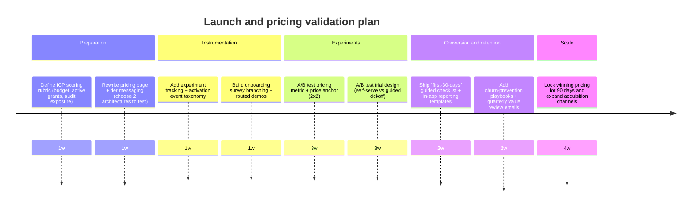

> **Status: archived.** Historical note: Proposal A shipped in April 2026 with earlier feature-based gating. Current public pricing is Starter $49/mo ($39/mo billed annually, $468/yr), Growth $99/mo ($79/mo billed annually, $948/yr), and Audit-Ready $199/mo ($159/mo billed annually, $1,908/yr). Enterprise is a custom founder-contact path, not a fourth self-serve plan card. See `packages/shared/src/pricing.ts` for current truth.

# Offer and Pricing Strategy Research for GrantPipe

## Executive summary

GrantPipe's current positioning is unusually crisp for a new product: it targets "mid-sized nonprofits with active grant portfolios" and promises a single system for donor management, grant tracking, restricted-fund context, and audit-ready compliance reporting-**without** the consultant-heavy burden that comes with enterprise CRMs.

Historical note: this analysis originally referenced early $20-$99/month exploratory tiers. Current GrantPipe self-serve pricing is Starter at $49/month ($39/month billed annually, $468/year), Growth at $99/month ($79/month billed annually, $948/year), and Audit-Ready at $199/month ($159/month billed annually, $1,908/year), with annual billing defaulted. Enterprise is a custom founder-contact path, not a fourth self-serve plan card.

The recommendation in this report is to treat pricing as part of the product (not an afterthought) by (a) clarifying the **core job-to-be-done** (post-award compliance + restricted funds + reporting), (b) packaging around **operational complexity** (active grants, programs, audit needs, integrations) rather than donor-record caps, and (c) adding a "services wrapper" (guided onboarding/migration + compliance setup) that shortens time-to-value and reduces churn.

Four tiered pricing architectures are provided (3-5 requested), along with year-1 revenue projections (conservative/moderate/optimistic) and a launch plan with a prioritized experimentation backlog.

## Current offering analysis based on grantpipe.com

### Target users and segmentation implied by the site

GrantPipe explicitly targets **mid-sized nonprofits** managing active grants, donor relationships, and board reporting-specifically teams that do **not** have a dedicated Salesforce admin. The implied "internal buyer committee" is cross-functional:

- Development/advancement leadership (donor CRM, board reporting)
- Finance/compliance (restricted funds, spend-down, audit readiness)
- Executive director/COO (tool consolidation, total cost of ownership)

This triangulation matters because it strengthens the business case: the pain is not "grant tracking" alone-it's **reconciling the same story across multiple systems** (donor history, restricted funds, reporting deadlines).

### Core value propositions and differentiators

The landing page repeats a consistent set of differentiators:

1. **Unification**: "Donor CRM and grant tracking in one system," with donors and grants sharing a system of record.
2. **Compliance outcome**: "Audit-ready compliance reports," "restricted funds without spreadsheet cleanup," and reporting exports run by staff in-house.
3. **Low-friction adoption**: "No setup fees," "self-serve onboarding," and "guided import support," positioned as the opposite of consultant retainers.
4. **Plan-first evaluation**: prospects pick a plan and then trial it (no credit card "today").

These points are coherent, and they also map to a broader macro signal: nonprofits increasingly operate in fragmented stacks and are actively considering CRM switches-driven by feature gaps and integration burden.

### Feature set and pricing currently presented

GrantPipe's current public self-serve pricing is:

- **Starter**: $49/month, or $468/year ($39/month billed annually), for teams replacing grant and donor spreadsheets.
- **Growth**: $99/month, or $948/year ($79/month billed annually), for active reporting teams with recurring deadlines.
- **Audit-Ready**: $199/month, or $1,908/year ($159/month billed annually), for teams with audit and accounting scrutiny.

Enterprise is a custom founder-contact path below pricing, not a fourth self-serve plan card. The launch offer has been retired.

**What this implies about packaging logic today:** tiers are driven by grant-operation complexity: active grant volume, compliance automation, restricted-fund depth, audit evidence, accounting outputs, and guided setup. This now matches GrantPipe's differentiation around grant compliance and restricted funds more closely than the early donor-record packaging did.

### Onboarding flow, support signals, and time-to-value

Two web pages provide the clearest "process truth" signals:

- The Terms of Service clarify that selecting a plan and sharing email "does not create a paid subscription" and that **no card is required**.
- The Privacy Policy indicates you collect follow-up details such as **organization budget, active grant count, and current tools**, and use Apollo.io for CRM.

This suggests the current "trial" is at least partially **concierge-gated** (or prelaunch), which is not a weakness-it can be a deliberate wedge to learn fast and drive high-touch onboarding while product gaps close.

**Time-to-value hypothesis based on the messaging:** GrantPipe is promising day-one usability via guided imports and a workflow that eliminates cross-system reconciliation. Your fastest demonstrable "aha" moments should therefore be:

- A compliance calendar populated from imported grants
- A restricted-fund spenddown view (per grant)
- A board-ready snapshot tying donors -> grants -> restrictions -> reporting dates

### Gaps and ambiguity surfaced by the site

The landing page is strong on narrative, but several gaps affect offer design:

- **Grant discovery** is not clearly offered. The product is described as donor+grants+compliance; discovery/matching is not prominent in the core feature bullets.
- **Integrations** are referenced as a migration pathway (e.g., moving from Salesforce/spreadsheets), but little is specified on the product pages visible here (API is mentioned only for Enterprise in some site contexts).
- If you truly support "restricted funds at the transaction level," you will eventually be pulled toward accounting workflows; that raises expectations around QuickBooks-class mapping, chart-of-accounts support, exports, audit trail, and role-based controls-features that the market associates with compliance-grade systems.

These gaps directly influence pricing strategy: unclear scope tends to force low pricing; clear scope can support premium ARPA.

## Market and competitive landscape

### Why this category can support higher pricing than typical "small nonprofit CRM"

Three external signals point to high pain, high switching, and high compliance stakes:

- Stack fragmentation: Omatic reported that **79% of respondents** used "five or more third-party systems" beyond their main CRM, and nearly half were considering changing CRMs within 12 months.
- Category dissatisfaction: Fifty & Fifty reported that about **one-third (33.3%)** of survey respondents rated their CRM systems as effective.
- Compliance stakes (federal awards): the Office of Management and Budget Uniform Guidance audit requirement (2 CFR Part 200) applies at material federal-spend levels; the current threshold is **$1,000,000** in federal awards expended for the year (Single Audit requirement), and record retention is generally **three years** from final reporting.

Separately, Government Accountability Office analysis found **$1.17 trillion** of direct federal award funds (2017-2021) were linked to severe and persistent Single Audit findings.
While that statistic is not "about software pricing," it is a credible external anchor for why "audit-ready compliance" is a value prop with real financial downside.

### Competitor pricing and packaging comparison

The table below focuses on primary sources (official pricing pages) where possible, supplemented by official policy pages when pricing is not published.

| Competitor                      | Primary segment                                               | Published pricing signal                                                                                         | Pricing model cues                                                                  | Key packaging takeaway                                                                                             |
| ------------------------------- | ------------------------------------------------------------- | ---------------------------------------------------------------------------------------------------------------- | ----------------------------------------------------------------------------------- | ------------------------------------------------------------------------------------------------------------------ |
| Instrumentl                     | Nonprofits and consultants; enterprise/university pathways    | $299/mo (Standard), $499/mo (Pro), $899/mo (Advanced), paid annually; monthly option higher; 14-day free trial   | Plan tiers with project limits; paid annually; integrations and API at higher tiers | Clear premium willingness-to-pay for "full lifecycle" plus integrations/SSO                                        |
| Grantseeker (now part of Fluxx) | Classic: broad nonprofit; Pro: complex portfolios, compliance | Classic: $14.99/mo or $39.99/mo (14-day trial); Pro: formula-based pricing + demo                                | Low-cost entry for tracking; enterprise features for compliance (SSO, SEFA, API)    | "Two products" strategy: cheap tracker + separate compliance-grade offering                                        |
| Grantable                       | Grant teams; AI writing + research; agency add-on planned     | Free; Starter $50/mo; Pro $150/mo; Agency Hub add-on $300/mo                                                     | Freemium + "usage depth" gating (AI usage) + add-ons                                | AI/ops tools anchor mid-market pricing; agency add-on signals strong consultant WTP                                |
| GrantWatch                      | Nonprofits, small businesses, individuals (directory)         | $22 weekly; $49 monthly; $100 quarterly; $249 annually                                                           | Subscription by duration; value framed as database access                           | "Database subscription" pricing supports broad low-mid pricing but not deep workflow value                         |
| GrantStation                    | Grant research database users                                 | Membership pages market $199/year; other site context references $699 list price                                 | Annual membership (frequent discounting)                                            | Annual membership + heavy discounting is common for grant databases                                                |
| Candid                          | Data + nonprofit/foundation research                          | Free tier; Premium $3,499/year starting; Ultimate $4,999/year starting (nonprofit pricing toggle)                | Annual tiers; "grants data" + compliance features at higher tiers                   | High annual price anchors "data authority" positioning; teams justify as research infrastructure                   |
| Salesforce (Nonprofit Cloud)    | Enterprise nonprofits                                         | $60/user/mo (Enterprise) and $100/user/mo (Unlimited), billed annually; 10 free licenses via Power of Us program | Per-seat, annual contracts; success plans and add-ons                               | Seat-based enterprise pricing with expansive ecosystem; often implies implementation cost                          |
| Neon One (Neon CRM)             | SMB/mid nonprofits with donors+events                         | Starts at $139/month                                                                                             | Revenue/plan based + add-ons                                                        | Mid-market CRM anchors at ~$139+; current GrantPipe pricing positions the product above micro-SMB donor-only tools |
| Little Green Light              | Small nonprofits                                              | Public constituent-based tiers (e.g., $45/mo up to 2,500)                                                        | Record-based tiering; predictable scaling                                           | Record-based pricing is common in donor CRMs-but can conflict with compliance "value-based" narrative              |
| Blackbaud (Raiser's Edge NXT)   | Mid/large nonprofits                                          | Pricing by quote ("request a call")                                                                              | Custom quote bundling implementation/training/support                               | Quote-based enterprise packaging signals high ACV and services-heavy deployments                                   |
| GrantForward                    | Universities & colleges                                       | Institution-size-based pricing; contact for details; 30-day free trial                                           | Institutional licensing model                                                       | Universities buy site licenses and want SSO, reporting, procurement compliance                                     |

### Competitive whitespace and opportunities

A notable market event: Foundant announced the sunset of GrantHub and GrantHub Pro effective **January 31, 2026**, stating they would refocus on funder-side tools.
That creates displacement: grant-seeking nonprofits who used GrantHub must replace workflows, and that replacement moment is when pricing, onboarding, and "ROI in the first 30 days" matter most.

## Pricing models and packaging patterns across segments

### Common pricing models actually used in this market

The competitor landscape shows four recurring models:

Subscription tiers (SMB/mid-market)
This is the dominant model for grant tools and CRMs: tiered plans with feature gating and "complexity caps." Instrumentl is the clearest example, with Standard/Pro/Advanced at $299/$499/$899 per month (annual), with SSO/API at higher tiers.

Freemium + usage depth gating
Grantable demonstrates a modern AI-oriented flavor: free plan, then higher plans that unlock significantly more AI usage and deeper data/products.

Low-cost directory memberships (grant databases)
GrantWatch and GrantStation show a different price anchor: affordable access to a database/listing service (often under $250/year in promo framing), typically without deep operational workflows.

Enterprise / institutional licensing (universities and big orgs)
GrantForward's pricing is explicitly tied to institutional size and research expenditure, and Salesforce is seat-based with annual contracts-both patterns reflect procurement reality for universities and enterprise nonprofits.

### Packaging strategy implications for your four target segment groups

Nonprofits (GrantPipe's current ICP)
If the core promise is compliance outcomes, you should package around **complexity**: active grants, restricted fund structure, number of programs, audit requirements, and integrations. Market behavior supports charging more when you own a meaningful operational workflow (Instrumentl) versus just listing opportunities (GrantWatch).

SMBs (small businesses seeking grants)
This segment is mostly served by "grant database" products, and price sensitivity is higher; $22/week-$249/year is an anchor. If GrantPipe remains a compliance-first nonprofit CRM, SMB is an adjacent segment better pursued through a differentiated product (or partner channel) rather than forcing one pricing page to fit all.

Universities
Universities buy by institution and require SSO, role-based access, reporting, and compliance with procurement/security review. GrantForward's published approach (price determined by institution size; 30-day trial) is representative. A university SKU for GrantPipe likely requires roadmap investments (institution-level admin, SSO, procurement documentation) and should be treated as "enterprise motion," not self-serve.

Grant consultants / agencies
Both Instrumentl and Grantable explicitly recognize consultants: Instrumentl has consultant plans, and Grantable is building an "Agency Hub" add-on ($300/mo). This segment often has higher WTP because the tool is directly tied to billable leverage and multi-client management. For GrantPipe, this is the best adjacent monetization path if you can support multi-client workspaces and client-facing reporting.

## Tiered pricing proposals for GrantPipe

The goal of these proposals is to give you 3-5 materially different architectures you can test-not to claim a single "correct" answer. The core design principle is: **price and package the thing you are best at** (audit/compliance outcomes + unified donor/grant record), not generic CRM storage.

### Proposal A: Nonprofit budget-based tiers

This option moves away from donor-record caps as the main value driver and instead sells the "compliance operating system" at a mid-market ARPA.

Assumptions: "Mid-sized" approximately $500K-$5M+ operating budgets (as implied by your positioning), multiple active grants, and cross-team usage.

| Tier        | Monthly price | Annual price | Best for                                       | Positioning + messaging                                                                              | What's gated                                                  |
| ----------- | ------------: | -----------: | ---------------------------------------------- | ---------------------------------------------------------------------------------------------------- | ------------------------------------------------------------- |
| Starter     |           $79 |         $588 | Small teams graduating from spreadsheets       | Be audit-ready without an admin. Unify donors + grants in 30 days.                                   | Up to 10 active grants; unlimited users; standard reports     |
| Growth      |           $99 |         $948 | Multi-program nonprofits                       | Stop reconciling finance + development. One operating view for grants, funds, and deadlines.         | Up to 50 active grants; operational control for growing teams |
| Audit-Ready |          $199 |       $1,908 | Orgs with audit scrutiny, complex restrictions | Compliance-grade controls: allocations, permissions, auditor portal, and implementation that sticks. | Up to 100 active grants; guided onboarding, import, and setup |

Trial/discount strategy: Keep your 30-day trial concept, but require a "guided setup" kickoff call for Growth+ to protect time-to-value.

### Proposal B: Low entry + compliance add-ons

This preserves a low entry point for price-sensitive orgs while keeping premium ARPA available for compliance-heavy customers. It's a good fit if you want volume and you can keep support costs low for the base tier.

| Tier        | Monthly price | Annual price (example) | Best for                                            | Positioning + messaging                                                | What's gated            |
| ----------- | ------------: | ---------------------: | --------------------------------------------------- | ---------------------------------------------------------------------- | ----------------------- |
| Essentials  |           $69 |                   $704 | "Organize grants + donors" without heavy automation | "Replace spreadsheets. Track the basics cleanly."                      | Automation/report packs |
| Compliance  |          $179 |                 $1,824 | Teams where deadlines/reporting are painful         | "Automate compliance deadlines and spenddown reporting."               | Auditor controls        |
| Audit Suite |          $349 |                 $3,564 | Audit scrutiny + multi-program complexity           | "Auditor-ready exports, permissioning, and external review workflows." | -                       |

Add-ons (attach to Compliance+): Integrations pack, auditor portal, and "program allocation engine." The market supports add-on monetization for advanced needs (e.g., Agency Hub add-on concept).

Trial/discount strategy: 30-day trial for Essentials/Compliance; Audit Suite includes a structured onboarding checklist with office hours.

### Proposal C: Consultant and agency edition

This is the best "adjacent" monetization model because the consultant market already pays for multi-client workflow tools (Instrumentl and Grantable both explicitly build for it).

| Tier         | Monthly price | Annual price (example) | Best for         | Positioning + messaging                                                          | What's gated                           |
| ------------ | ------------: | ---------------------: | ---------------- | -------------------------------------------------------------------------------- | -------------------------------------- |
| Solo         |          $129 |                 $1,317 | 1-2 client shops | "Deliver compliance workflows your clients can actually run."                    | Multi-client dashboards                |
| Agency       |          $399 |                 $4,069 | 3-10 clients     | "Standardize delivery: templates, client portals, consolidated reporting."       | White-label exports; advanced controls |
| Agency Scale |          $799 |                 $8,149 | 10+ clients      | "Multi-client operations with permissions, audit packs, and reporting at scale." | -                                      |

Packaging note: make "client workspace" (not seats) the main metered unit. That aligns with how consultants monetize.

Trial/discount strategy: 14-day trial (shorter is acceptable for pros), plus quarterly billing option (reduces friction).

### Proposal D: Premium nonprofit + guided onboarding

This option assumes you want a more explicit "outcome + services" offer. It typically improves conversion and retention in compliance-heavy products, because many nonprofits fear migration risk more than they fear subscription cost.

| Tier  | Monthly price | Annual price (example) | Best for                              | Positioning + messaging                                                               | What's gated                              |
| ----- | ------------: | ---------------------: | ------------------------------------- | ------------------------------------------------------------------------------------- | ----------------------------------------- |
| Core  |          $149 |                 $1,520 | Nonprofits with 3-10 active grants    | "Compliance OS, ready fast-no more grant spreadsheet cleanups."                       | Limited allocations/integrations          |
| Pro   |          $399 |                 $4,070 | Multi-program orgs                    | "Operationalize restricted funds with reporting your auditor trusts."                 | Complex permissions and auditor workflows |
| Scale |          $699 |                 $7,129 | Audit-heavy, multi-program complexity | "Compliance-grade workflows with program allocation, portals, and dedicated rollout." | -                                         |

Bundled services: include a defined onboarding package in Pro/Scale (not quoted, not open-ended). This also makes your promise "no consultants required" more credible: you're replacing _consultant sprawl_ with _productized onboarding_ rather than denying services exist.

## Revenue scenarios and projections

### Modeling approach and assumptions

Because your current MRR/user counts are unspecified, projections use explicit, range-based assumptions. The model below estimates year-1 revenue using:

- Fixed new-customer acquisition per month (varies by scenario)
- Monthly churn assumptions (varies by segment and positioning)
- Weighted ARPA per proposal (based on tier mix)

These are "exit ARR" (MRR in month 12 x 12) and "average ARR" (average MRR over year 1 x 12). They are designed to compare pricing architectures, not to forecast with precision.

### Revenue scenario table

| Proposal   | Scenario     | New customers / month | Monthly churn | ARPA (blended, $/mo) | Customers at month 12 | Exit ARR | Avg ARR (year 1) |
| ---------- | ------------ | --------------------: | ------------: | -------------------: | --------------------: | -------: | ---------------: |
| Proposal A | Conservative |                     8 |            4% |                  184 |                    77 |    $171K |            $100K |
| Proposal A | Moderate     |                    15 |            3% |                  184 |                   161 |    $338K |            $193K |
| Proposal A | Optimistic   |                    30 |            2% |                  184 |                   323 |    $713K |            $401K |
| Proposal B | Conservative |                    10 |            5% |                  165 |                    92 |    $182K |            $108K |
| Proposal B | Moderate     |                    18 |            4% |                  165 |                   174 |    $345K |            $201K |
| Proposal B | Optimistic   |                    35 |            3% |                  165 |                   341 |    $675K |            $404K |
| Proposal C | Conservative |                     3 |            3% |                  325 |                    32 |    $124K |             $68K |
| Proposal C | Moderate     |                     6 |            2% |                  325 |                    69 |    $269K |            $141K |
| Proposal C | Optimistic   |                    12 |          1.5% |                  325 |                   140 |    $545K |            $288K |
| Proposal D | Conservative |                     5 |            3% |                  319 |                    53 |    $203K |            $112K |
| Proposal D | Moderate     |                    10 |          2.5% |                  319 |                   110 |    $420K |            $227K |
| Proposal D | Optimistic   |                    20 |            2% |                  319 |                   215 |    $823K |            $463K |

**Interpretation:** If you can acquire customers at similar rates, the biggest lever is ARPA and churn. Proposal D yields the highest exit ARR in the optimistic case because premium ARPA plus services tends to lower churn _if_ onboarding is executed well.

## Testing, launch, and retention plan

### Recommended positioning statement

> For mid-sized nonprofits managing restricted grants and donor relationships without a dedicated admin, GrantPipe is the compliance-first nonprofit CRM that unifies donors, grants, restricted funds, and reporting deadlines into audit-ready workflows your team can run in-house-without consultant-led implementations.

This statement is intentionally anchored to your existing promise ("No Consultants Required," compliance, donors+grants).

### Highest-impact A/B tests

Pricing and packaging tests (highest leverage)
Test these as controlled experiments on the pricing page and via onboarding surveys (you already collect budget/grant count/current tools).

1. **Tier metric test:** donor-record cap vs "active grants/programs" as the primary cap. (Hypothesis: compliance buyers respond better to operational complexity caps than constituent-count caps.)
2. **Price anchor test:** current self-serve $329-$1,079 tiers vs adjacent mid-market anchors with clear ROI framing (audit risk + labor savings).
3. **Plan naming test:** "Foundation/Growth/Enterprise" vs compliance-oriented naming ("Starter/Growth/Audit-Ready").
4. **Trial design test:** fully self-serve trial vs "guided kickoff required for Pro+." (Hypothesis: guided kickoff increases activation and reduces churn in compliance workflows.)
5. **Annual default test:** default to annual checkout with explicit savings vs default monthly (benchmark: many B2B tools push annual to reduce churn; Salesforce is annual by default for many SKUs).

Offer/message tests (conversion) 6. "Replace Salesforce" framing vs "Replace donor CRM + grant spreadsheets" framing. (Your current messaging leans toward the latter; test the former only for high-intent evaluator traffic.) 7. "Audit-ready exports" headline vs "restricted funds without spreadsheets" headline. Use compliance vs operations angle based on persona.

### Launch and testing timeline

### Onboarding tactics that shorten time-to-value

Because GrantPipe sells "audit-ready compliance" and "no cleanup," onboarding must produce a tangible compliance artifact quickly.

Activation milestones (track as product KPIs):

- Imported donors + imported or created grants (migration)
- First compliance calendar populated (deadlines per grant)
- First "restricted fund spenddown" view generated
- First export/report generated for a board packet or funder report

Productized rollout tactics:

- A "Migration Sprint" (one week) with explicit scope: import donors, import grant portfolio, tag restricted funds, generate baseline reports.
- Templates library: common funder report formats, documentation checklists aligned to Uniform Guidance retention expectations (three years).

### Retention tactics aligned to the compliance job-to-be-done

Retention in compliance software is driven by (a) recurring deadlines, (b) audit cycles, and (c) staff turnover.

Recommended retention mechanisms:

- Quarterly "audit readiness check" reports (what's missing by grant)
- Automated deadline reminders + escalation paths (finance + development), because missed deadlines are existential
- Role-based "auditor portal" workflow as a sticky feature in higher tiers (it ties you into an annual ritual)

### Likely objections and rebuttals

Objection: "We already have a donor CRM."
Rebuttal: Your donor CRM likely does not track restricted funds and compliance in a way that eliminates reconciliation work; GrantPipe is positioned as the system where donors and grants share context so finance and development tell one story.

Objection: "We can't risk switching systems."
Rebuttal: Keep the month-to-month trial ethos, but shift emphasis from "try the UI" to "complete a migration sprint and produce one compliance report." Your own terms already reduce procurement friction (no card required at selection).

Objection: "We're too small to pay enterprise prices."
Rebuttal: Offer a lower entry tier _only if_ it can be served profitably. The market shows small orgs do buy tools (e.g., $45-$90/mo donor CRM tiers) and grant databases (~$249/yr). The key is to align entry-level packaging to low-support, narrow scope.

Objection: "Compliance risk is overblown."
Rebuttal: Federal compliance requirements include audit thresholds and multi-year record retention. Even below the Single Audit threshold, records must be available for review and retention rules apply.

### What to choose first

If you want the most "on-strategy" path relative to your current positioning, choose **Proposal A** or **Proposal D** as the primary test candidate:

- Proposal A if you want simple SaaS tiers and faster self-serve scaling.
- Proposal D if your near-term advantage is high-touch onboarding, fast learning, and retention via productized services (especially plausible given the current plan-selection + email flow in your Terms).
