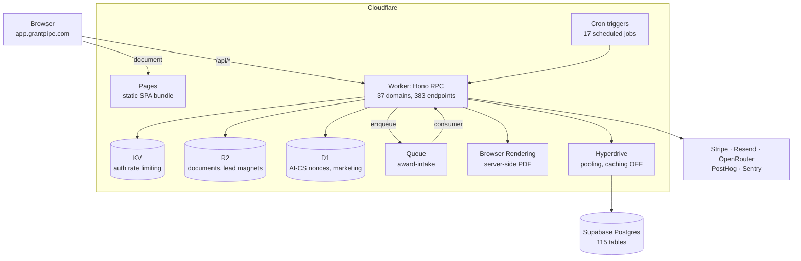

# System design

How GrantPipe is put together, and why. For the annotated tour of the parts that
were actually hard, see [`portfolio/ENGINEERING-LOG.md`](./ENGINEERING-LOG.md).

## Three deployables, one type system

```text
apps/site   Astro 6 static site      -> grantpipe.com          (Cloudflare Pages)
apps/web    React 19 + Vite SPA      -> app.grantpipe.com      (Cloudflare Pages)
apps/api    Hono on Workers          -> app.grantpipe.com/api  (Cloudflare Workers)

packages/db       Drizzle schema + migrations   (Postgres)
packages/shared   Zod validators, types, constants, marketing knowledge base
packages/ui       Shadcn components + design tokens, shared by web and site
```

The split is deployment-shaped, not layer-shaped. The marketing site and the
application have different rendering models, different caching, and different
release cadences, so they are different builds. Everything they agree on lives
in `packages/`.

## Request path



Hyperdrive runs with query caching **explicitly disabled**, documented inline:
Better Auth reads session state on nearly every request, and a cached read there
would serve a revoked session.

## Type safety without codegen

`apps/api` exports its router type. `apps/web` imports that type and builds a
client from it:

```ts
// apps/api/src/app.ts
export type AppType = typeof app;

// apps/web/src/lib/api-client.ts
const client = hc<AppType>("/");
```

There is no OpenAPI document, no generated SDK, and no sync step that can drift.
Change a route's input or output shape and the client stops compiling. In a
codebase with one engineer and no reviewer, a contract that breaks the build is
worth more than a contract written down somewhere.

## Domain-grouped API

```text
apps/api/src/domains/<domain>/
    routes.ts     HTTP surface: validation, auth, status codes
    service.ts    business logic: the part worth testing
```

37 domains, 383 endpoints (142 GET, 139 POST, 53 PATCH, 43 DELETE, 6 PUT). A
change to how grants work stays inside `domains/grants/` rather than touching a
shared controller that every feature also touches. One domain (`trial-emails`)
has a service and no routes at all. It exists only as a scheduled job.

## Tenancy

Two levels, because a real nonprofit is often more than one legal entity: a
national with chapters, or a fiscal sponsor with sponsored projects that must
report separately.

- **Organization**: the billing and membership boundary. Every table carries
  `org_id`.
- **Legal entity**: the reporting boundary inside an org. Entity membership has
  its own roles and permission overrides.

`apps/api/src/middleware/org-entity-context.ts` resolves both from `X-Org-Id`
and `X-Entity-Id` headers and hands routes a database handle already scoped to
them. Route authors do not filter by tenant; they are given something that
cannot see across the boundary.

The resolution rules are worth stating precisely, because "fails closed" is only
half true:

| Situation                                            | Behaviour                                           |
| ---------------------------------------------------- | --------------------------------------------------- |
| No `X-Org-Id` header                                 | Falls back to the caller's most recently joined org |
| No `X-Entity-Id` header                              | Falls back to the org's `default_entity_id`         |
| Header names an org or entity the caller may not use | **403, no fallback**                                |
| Named default entity is missing or inactive          | **403, no fallback**                                |

So the fallbacks are for _absent_ headers; an _explicit_ header pointing
somewhere the caller cannot go is always denied rather than quietly downgraded.
The three denial paths are named values (`entity_switch_denied`,
`missing_default_entity`, `inactive_or_missing_entity`) reported to Sentry, and
16 test cases in `org-entity-context.test.ts` pin the behaviour.

## Data model

115 tables, 95 migrations, 167 indexes. The parts that drove the shape:

- **Grants and funds are separate entities**, joined through
  `grant_fund_allocations`. An award and the restricted fund it lands in are
  different things under FASB ASC 958, and collapsing them makes restriction
  reporting impossible later.
- **Restriction machinery is a ledger, not a flag**: `restriction_terms` with
  allowed-category rules, then `restriction_additions` / `restriction_releases`
  / `restriction_balances` period rollforwards, plus evidence links.
- **Money is integer cents** everywhere: storage, transport, and computation.
  Formatting happens once, at the display layer.
- **Soft delete** (`deleted_at`) on every main entity. No hard deletes in
  application code.
- **Polymorphic activity log** with a JSONB diff per change, so every table gets
  an audit trail without a bespoke logging path per domain.
- **Custom fields** use an EAV pair (`custom_field_definitions` +
  `custom_field_values`) so an org adds a field without a schema migration.

## Asynchronous and scheduled work

- **Queue**: award-document extraction. Upload enqueues; a consumer calls the
  model; a recovery job redispatches extractions that got stuck.
- **Cron**: 17 scheduled jobs in one `scheduled()` handler, run through
  `Promise.allSettled` so one failure cannot starve the rest. Each job declares
  whether it is safe to retry on a transient database error.
- **Browser Rendering**: server-side PDF generation for reports and lead
  magnets, rather than shipping a PDF engine to the client.

## Observability as a build gate

Every feature ships with PostHog events and Sentry capture. That claim is
machine-checked rather than asserted:
`scripts/analytics-event-governance.ts` scans all three apps for `captureEvent`
/ `trackEvent` literals and fails the build on any event name missing from the
canonical registry in `packages/shared` (a six-name allowlist covers
feedback-widget telemetry that is deliberately outside the product taxonomy).

## Retired surfaces

QuickBooks / accounting-integration sync was built and then **removed**. The
routes return `410 Gone`, and a contract test asserts the service and queue
files stay deleted and the dead secrets, queue bindings, and frontend hooks stay
gone. Six tables remain in the schema; they are inert. If you are reading
`packages/db/src/schema/accounting.ts` and wondering whether this is a live
integration: it is not.
