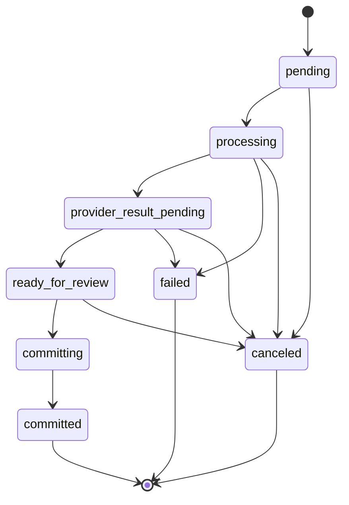

# Engineering notes

The parts of GrantPipe that were actually hard, and why they are built the way
they are. Everything below points at real files. This is a reading guide, not a
brochure. For the shape of the system, see
[`portfolio/ARCHITECTURE.md`](./ARCHITECTURE.md).

---

## 1. Money that cannot drift

[`packages/shared/src/validators/allocation-math.ts`](../packages/shared/src/validators/allocation-math.ts)

Splitting a grant across funds uses **largest-remainder apportionment** over
basis-point weights. The invariants are enforced, not assumed:

- Weights must be non-negative integers summing to exactly `10000` bps.
- The output array sums **exactly** to the input amount. The remainder is
  distributed, never dropped or rounded away.
- The sign is extracted before apportionment and reapplied after, so negative
  amounts split identically to positive ones.
- Ties in the remainder are broken by lower index, so the same input always
  produces the same output.

No float ever touches a dollar. Every monetary value in the system is an integer
number of cents from the database through to the API boundary; formatting
happens once, at render.

This is the shortest file in the repo that explains how the codebase treats
correctness, which is why it is first on the reading list.

## 2. Double-entry accounting with real pledge treatment

[`apps/api/src/domains/accounting/postingEngine.ts`](../apps/api/src/domains/accounting/postingEngine.ts) (1,543 lines)

Donations, expenses, grant payments and pledges all post real journal entries
with balanced debit and credit lines, sequential entry numbering, and
fiscal-period awareness.

The part that goes beyond bookkeeping is **ASC 958-605 pledge accounting**. A
multi-year pledge is not worth its face value today, so:

- Initial recognition discounts the pledge to present value against a discount
  contra-account.
- `postPledgeAccretion` unwinds that discount over time as interest accretion.
- Allowance-for-uncollectible adjustments are posted separately from write-offs.
- A write-off cleans up the residual discount rather than stranding it.

Every posting is reversible through `reverseSourceLinkedEntries`, which creates
a mirrored entry with debits and credits swapped and links it back through
`reversedByEntryId`. Corrections are new entries, not mutations. That is the
only version of an audit trail an auditor will accept.

## 3. Restriction release as a guarded transaction

Same file, and [`packages/db/src/schema/restrictions.ts`](../packages/db/src/schema/restrictions.ts)

A restricted fund is not a boolean. It is a ledger: `restriction_terms` carrying
allowed-category rules, then `restriction_additions`, `restriction_releases`,
and `restriction_balances` period rollforwards, with evidence links attached.

When an expense hits a restricted fund, the posting engine (inside the same
transaction as the GL write) finds the matching restriction term (grant-specific
first, falling back to fund-level), checks the expense category against the
term's allowed categories, computes the available balance from the
addition/release ledger, and refuses to over-release:

```ts
throw badRequest("Release exceeds available restricted balance");
```

Concurrency is handled with `pg_advisory_xact_lock(hashtext('${orgId}:${termId}'))`.
Two simultaneous expenses against the same restricted term serialize rather than
both reading a stale balance and both succeeding. Releasing restricted money
against an ineligible category is a rejected operation, not a footnote in a
report three months later.

## 4. Federal rules as executable, effective-dated logic

[`apps/api/src/domains/payments/ug-guardrails.service.ts`](../apps/api/src/domains/payments/ug-guardrails.service.ts)
· [`apps/api/src/domains/compliance/sefa.service.ts`](../apps/api/src/domains/compliance/sefa.service.ts)

2 CFR Part 200 is encoded as constants with citations and effective dates, not
as institutional memory:

| Rule                        | Value in code                                |
| --------------------------- | -------------------------------------------- |
| De minimis indirect rate    | `DE_MINIMIS_RATE_PERCENT = 15`               |
| MTDC subaward exclusion cap | `MTDC_SUBAWARD_CAP_CENTS = 5_000_000`        |
| Equipment capitalization    | `EQUIPMENT_THRESHOLD_CENTS = 1_000_000`      |
| Single audit threshold      | `SINGLE_AUDIT_THRESHOLD_CENTS = 100_000_000` |
| Early-warning band          | `WATCH_THRESHOLD_RATIO = 0.8`                |

Indirect-cost rules resolve through `loadActiveIndirectRule`, which filters by
`effectiveFrom` / `effectiveTo`, then sorts grant-specific rules ahead of
org-wide ones, then by most recent effective date. A rule change in October does
not retroactively rewrite September's payment requests.

[`apps/api/src/domains/payments/indirect.service.ts`](../apps/api/src/domains/payments/indirect.service.ts)
classifies MTDC and salary-basis lines by keyword-matching the expense description rather than a
structured cost-category field. A `costCategory` column to replace the keyword match is planned for
V2.

The 80% watch band is the design point worth noting: crossing $1,000,000 in
federal expenditures triggers a mandatory Single Audit. Telling an organization
after they crossed it is useless. The SEFA service flags at $800,000, while
there is still a decision to make.

## 5. A regression test that greps the entire repository

[`apps/site/src/audit-threshold-amount.test.ts`](../apps/site/src/audit-threshold-amount.test.ts)

The 2024 OMB revision to the Uniform Guidance changed four numbers that appear
constantly in this domain. The single audit threshold rose from the prior
three-quarter-million-dollar figure to $1,000,000. Those figures are scattered across roughly 1,500 markdown content
files as well as the application code.

This test shells out to `git grep` across every tracked file hunting for the
retired figure and fails the build if it reappears. Two details make it work:

- **The retired literal is never written in the test source.** It is reassembled
  from string fragments at runtime, so the test cannot match itself.
- An allowlist covers explainer content that legitimately teaches the
  before-and-after contrast.

It is a content-correctness guard, and it protects prose the compiler has no
opinion about.

## 6. Tenancy as a structural property

[`apps/api/src/middleware/org-entity-context.ts`](../apps/api/src/middleware/org-entity-context.ts)

Two levels, because a real nonprofit is often several legal entities: a
national with chapters, or a fiscal sponsor with sponsored projects that report
separately. Organization is the billing and membership boundary; legal entity is
the reporting boundary inside it, with its own roles and permission overrides.

Route authors get a database handle already scoped to both. Across 37
domains, nobody has to remember to filter by tenant.

The resolution rules are worth stating precisely, since "fails closed" is only
half the story:

| Situation                                            | Behaviour                                           |
| ---------------------------------------------------- | --------------------------------------------------- |
| No `X-Org-Id` header                                 | Falls back to the caller's most recently joined org |
| No `X-Entity-Id` header                              | Falls back to the org's `default_entity_id`         |
| Header names an org or entity the caller may not use | **403, no fallback**                                |
| Named default entity is missing or inactive          | **403, no fallback**                                |

So the fallbacks are for _absent_ headers. An _explicit_ header pointing
somewhere the caller cannot go is always denied, never quietly downgraded to
something they can see. The three denial paths are named values
(`entity_switch_denied`, `missing_default_entity`, `inactive_or_missing_entity`)
reported to Sentry, and 16 test cases pin the behaviour.

A security review early in the project found two cross-tenant bugs of exactly
the kind this structure prevents. Both are fixed, and
[`portfolio/SECURITY.md`](./SECURITY.md) is
kept in the repo with its resolution status rather than quietly deleted.

## 7. A signed, replay-protected bridge between two products

[`apps/api/src/domains/ai-cs/context-routes.ts`](../apps/api/src/domains/ai-cs/context-routes.ts)

The in-app support assistant runs as a separate service that needs GrantPipe
context server-to-server. That endpoint is public, so it authenticates on
something other than a session cookie:

- HMAC-SHA256 over `{timestamp}.{nonce}.{METHOD}.{path}.{bodyHash}`.
- Comparison is **timing-safe**: an XOR accumulator, not `===`.
- A five-minute clock-skew window bounds replay.
- The nonce is **consumed from D1**, so a captured request cannot be replayed
  even inside that window.
- The response is signed the same way, so the caller can verify GrantPipe's
  reply too.

It is mounted before session middleware deliberately, because it authenticates
by signature rather than by cookie. The signed request body is `{appId, userId}`;
the remaining context travels in the path and query string and is covered by the
path component of the signature.

## 8. AI that proposes and never commits

[`apps/api/src/domains/document-extractions/openrouter.ts`](../apps/api/src/domains/document-extractions/openrouter.ts)
· [`apps/api/src/domains/document-extractions/service.ts`](../apps/api/src/domains/document-extractions/service.ts)

Upload an award letter; it goes onto a Cloudflare Queue and comes back as
structured, checkable data. The extraction record's `status` column carries it
through a real pipeline, not a boolean "done" flag:



That's the full set of values `documentExtractions.status` ever takes
(`DOCUMENT_EXTRACTION_STATUSES`,
[`packages/shared/src/validators/document-extractions.ts:9-18`](../packages/shared/src/validators/document-extractions.ts)).
`commitDocumentExtraction` moves `ready_for_review` straight to `committing`
on success
([`service.ts:1072-1078`](../apps/api/src/domains/document-extractions/service.ts)); there
is no `accepted` state at the extraction level.
`cancelDocumentExtraction`
([`service.ts:649-670`](../apps/api/src/domains/document-extractions/service.ts))
can cancel from `pending`, `processing`, `provider_result_pending`, or
`ready_for_review`, the `provider_result_pending` edge included, which is easy
to miss because nothing else touches the row while a provider result is
staged.

`accepted`, `edited`, `rejected`, `deferred`, and `mapped_existing` are not
extraction states. They live on `documentExtractionFields.status`, a separate
per-field review column
(`recordDocumentExtractionAction`,
[`service.ts:551-634`](../apps/api/src/domains/document-extractions/service.ts)).
Nothing gates a field's current status before that function overwrites it, so
a single field can be accepted, then edited, then accepted again, any number
of times, while `documentExtractions.status` sits unchanged at
`ready_for_review` throughout. It's a category on each field, not a sequence,
which is why it doesn't belong in the extraction's state diagram. The
extraction only leaves `ready_for_review` once `findBlockingCommitFields`
returns empty and a caller invokes `commitDocumentExtraction`. That gate (not
a per-field state loop) is the mechanism behind "extraction proposes; a human
verifies before anything is written."

- The model is pinned to `google/gemini-3.1-flash-lite`, a stable release
  rather than a `-preview` alias, specifically so a paid feature does not break
  when the preview channel rotates.
- A strict JSON schema constrains the response. Every extracted field must carry
  a `confidence`, a canonical `destinationEntityType` / `destinationField`
  naming where it would land, and **at least one `sources[].snippet`** quoting
  the document text it came from (`minItems: 1`).
- Money comes back as integer cents.
- The prompt is versioned: `AWARD_INTAKE_PROMPT_VERSION = "award-intake-v3"`.

Extraction proposes; a human verifies before anything is written. **No model is
anywhere near the accounting or compliance math.** That path is entirely
deterministic. The AI reads documents. It does not do arithmetic that ends up in
a federal report.

## 9. Metering that survives a race

[`apps/api/src/lib/ai-usage.ts`](../apps/api/src/lib/ai-usage.ts)

Plan tiers cap AI usage per month. A naive counter double-counts under
concurrency and blocks paying customers under retry. This one:

- Serializes the quota decision per org + feature + month with
  `pg_advisory_xact_lock(hashtextextended(...))`.
- Records usage through an idempotent insert backed by a partial unique index,
  swallowing duplicate-key `23505`, so a retried award-intake job does not
  consume two units of quota.
- Skips the database entirely for uncapped tiers via a `Number.isFinite(cap)`
  check, so unlimited plans pay no coordination cost at all.

## 10. Scheduled work that knows whether it can be retried

[`apps/api/src/app.ts`](../apps/api/src/app.ts) `scheduled()` ·
[`apps/api/src/lib/db-retry.ts`](../apps/api/src/lib/db-retry.ts)

Seventeen cron jobs run through `Promise.allSettled`, so one failing job cannot
starve the rest. Each declares whether it is safe to retry on a transient
database error, and the interesting ones say why inline. Trial-expiry, for
example, is `retryTransient: false` because it emits an event _before_ stamping
its marker; retrying would double-send. Most others are `true` because a
`dedupeKey` plus `onConflictDoNothing` makes them naturally idempotent.

`db-retry.ts` classifies Postgres failures by SQLSTATE class: connection-class
`08` is transient and worth retrying; `22`, `23`, `42`, `0A`, `3D`, `3F` are
deterministic and retrying them just burns time. The comments cite the
production Sentry issues that motivated the code, including `GRANTPIPE-API-17`,
a bug where a retry gate was silently dead in production because Drizzle always
wraps the underlying error in `.cause`.

Six of the seventeen jobs declare `retryTransient` with no justification comment, and two of the
cited issue IDs read as placeholders rather than real tickets.

## 11. Tests that enforce architecture, not just behaviour

Three guard tests do work a linter cannot:

- **Analytics coverage:**
  [`scripts/analytics-event-governance.ts`](../scripts/analytics-event-governance.ts)
  scans all three apps for `captureEvent` / `trackEvent` literals and fails the
  build on any event name missing from the canonical registry. "Every feature
  ships with analytics" is a claim most codebases cannot back; here it is
  machine-checked. A six-name allowlist covers feedback-widget telemetry that
  sits outside the product taxonomy on purpose.
- **Proving a feature stayed dead:**
  [`scripts/accounting-integration-retirement-contract.test.ts`](../scripts/accounting-integration-retirement-contract.test.ts)
  asserts that the retired QuickBooks sync's service and queue files remain
  deleted and that its secrets, queue bindings, and frontend hooks are still
  gone. Deleting a feature is easy; keeping it deleted is the hard part.
- **Constraining what the content pipeline may claim:**
  [`scripts/hunt-lies/founder-rule.ts`](../scripts/hunt-lies/founder-rule.ts)
  blocks fabricated user counts, invented testimonials, and first-person claims
  of nonprofit-sector experience the author does not have.

## 12. A build pipeline with a verification step

[`apps/site/scripts/build-lead-magnet-pdfs.ts`](../apps/site/scripts/build-lead-magnet-pdfs.ts)
→ [`apps/api/src/scripts/sync-lead-magnets-to-r2.ts`](../apps/api/src/scripts/sync-lead-magnets-to-r2.ts)

Lead-magnet PDFs are rendered with Puppeteer at build time, keyed by content
hash so unchanged documents are skipped, with cross-platform Chrome/Edge
discovery and automatic relaunch if the browser disconnects mid-run.

They are then synced to R2 and **verified as remote objects before the deploy
proceeds**: magic-byte check (`%PDF`), minimum size, and a trailing `%%EOF`
marker. A deploy that would have served a truncated PDF fails instead.
